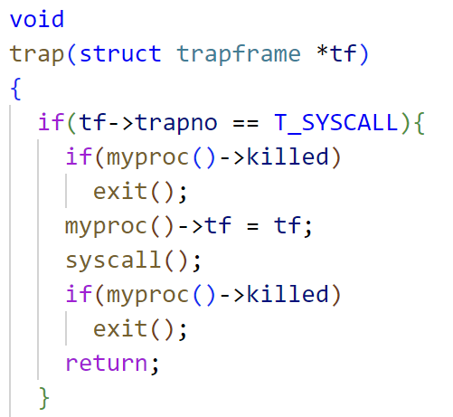
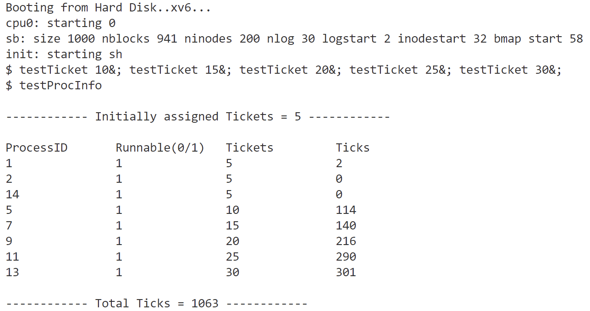

# 华东师范大学数据学院实验报告
<table>
  <tr>
    <td>课程名称 ：操作系统</td>
    <td>年级：2022级</td>
    <td>上机实践成绩：</td>
  </tr>
  <tr>
    <td>指导教师：翁楚良</td>
    <td>姓名：刘蔚璁</td>
    <td></td>
  </tr>
  <tr>
    <td>上机实践名称：彩票调度 </td>
    <td>学号：10225501443</td>
    <td>上机实践日期：2024.4</td>
  </tr>
</table>

## 一、实验目的
- 熟悉调度程序的工作原理。
## 二、实验内容
- 将调度程序更改为新的彩票调度算法。
## 三、实验环境
VSCode
## 四、实验过程及结果
### 预备知识
在开始实验前，首先需要了解彩票调度的思想与 xv6 的运行原理。

- #### 彩票调度
    - 核心思想
      通过分配不同数量的彩票给不同的进程，来决定进程被选中执行的概率。通常情况下，彩票数越多的进程被选中的概率就越高。
    - 步骤
        - 分配彩票：为每个可运行的进程分配一定数量的彩票。
        - 抽奖：当需要选择下一个要运行的进程时，系统会模拟彩票抽奖的过程。即，系统会根据每个进程拥有的彩票数量计算出总共的彩票数，并随机生成一个小于等于总彩票数的随机数作为中奖号码。
        - 选择进程：根据抽奖得到的中奖号码，系统将选择拥有彩票的进程中彩票数累加后刚好大于等于中奖号码的那个进程作为下一个要执行的进程。
        - 执行进程：选中的进程将被调度到 CPU 上执行，直到完成其任务或者被其他进程抢占CPU。

- #### XV6
    要完成这个实验，最基本的就是要了解 xv6 进程调度和系统调用的运行原理，我参考了 xv6 的中文文档来了解这个操作系统（https://th0ar.gitbooks.io/xv6-chinese/content/index.html）
    - ##### 操作系统接口
        xv6 分为用户空间和内核空间，进程通过系统调用来使用内核服务，系统调用会进入内核，让内核执行服务然后返回。
    
    内核提供的一系列系统调用就是用户程序可见的操作系统接口，比如 `fork()`、`exit()`、`wait()` 等等。
    - ##### 进程
        进程是一个抽象概念，它让一个程序可以假设它独占一台机器，xv6 使用页表（由硬件实现）来为每个进程提供其独有的地址空间。
        一个 xv6 进程分为：
        - 用户内存空间（指令、数据、栈）
        - 仅对内核可见的进程状态

        在xv6中，对进程控制块 `struct proc` 的定义和相关的操作函数实现，例如进程的初始化、创建和销毁等主要在 `proc.c` 中实现。
        每个进程都有一张表 `struct proc`，它是操作系统内核用来跟踪和管理系统中所有进程的数据结构，在 `proc.h` 中定义：
        ```c
        enum procstate { UNUSED, EMBRYO, SLEEPING, RUNNABLE, RUNNING, ZOMBIE };

        struct proc {
        uint sz;                     // 表示进程的内存大小，以字节为单位
        pde_t* pgdir;                // 指向页表的指针，用于管理进程的虚拟内存
        char *kstack;                // 指向内核栈底部的指针，用于保存进程在内核态执行时的栈信息
        enum procstate state;        // 表示进程的状态，是一个枚举类型
        int pid;                     // 进程的唯一标识符，即进程ID
        struct proc *parent;         // 指向父进程的指针
        struct trapframe *tf;        // 指向当前系统调用的陷阱帧的指针，用于保存进程在用户态被中断时的寄存器状态
        struct context *context;     // 指向上下文切换信息的指针，用于保存进程在内核态被中断时的上下文信息
        void *chan;                  // 如果进程正在等待某个条件（如等待文件I/O完成），则指向该条件的指针
        int killed;                  // 如果非零，表示进程已经被杀死
        struct file *ofile[NOFILE];  // 表示进程打开的文件数组
        struct inode *cwd;           // 指向当前工作目录的指针
        char name[16];               // 进程名称，用于调试目的
        int ticket;                  //进程彩票数
        int tick;                    //时间片数
        };
        ```
        每个进程都有用户栈和内核栈 `p->kstack` 。当进程运行用户指令时，只有用户栈被使用，内核栈则是空的。当进程通过系统调用或中断进入内核时，内核代码就在进程的内核栈中执行；进程处于内核中时，其用户栈仍然保存着数据，只是暂时处于不活跃状态。
        - ##### 创建进程
            在 main 初始化了一些设备和子系统后，它通过调用 `userinit` 建立了第一个进程,它首先调用 `allocproc` 分配结构体 `struct proc` 并对其进行初始化。 `allocproc` 在每个进程被创建时都会被调用。
            （ `userinit` 和 `allocproc` 都在 `proc.c` 中 ）
        - ##### 运行进程
            在 `main` 调用了 `userinit` 之后， `mpmain` 调用 `scheduler` 开始运行进程:
            - `scheduler` 会找到为一个 `p->state` 为 `RUNNABLE` 的进程 `initproc` ，然后将 `per-cpu` 的变量 `proc` 为该进程，接着调用 `switchuvm` 通知硬件开始使用目标进程的页表。
            - `scheduler` 接着把进程的 `p->state` 设置为 `RUNNING`，调用 `swtch`，切换上下文到目标进程的内核线程中。
        - ##### CPU
            `proc.h` 中定义了 CPU 结构体，包含 CPU 的一些信息和状态
            ```c
            struct cpu {
            uchar apicid;                // 本地 APIC 的 ID，用于多处理器系统中识别每个处理器
            struct context *scheduler;   // 指向 context 结构体的指针，用于在进程调度时执行上下文切换
            struct taskstate ts;         // 由 x86 架构使用的任务状态段，用于在中断时找到中断处理程序所需的堆栈
            struct segdesc gdt[NSEGS];   // x86 全局描述符表（Global Descriptor Table），用于管理内存段的访问权限和属性
            volatile uint started;       //  CPU 是否已经启动的标志
            int ncli;                    //  pushcli 函数的调用深度，用于跟踪中断嵌套
            int intena;                  // 在调用 pushcli 之前中断是否被启用的标志
            struct proc *proc;           // 指向当前 CPU 上运行的进程的指针，如果没有正在运行的进程则为 null
            };            
            ```
    - ##### 系统调用
        用户程序通过系统调用请求系统服务，这是通过中断/陷入来实现的。
        - 在 xv6 中， `user.h` 定义了用户空间所需的系统调用接口、常量和数据结构
        - 用户空间的系统调用接口函数会触发 `usys.S` 中定义的汇编语言接口函数，这些接口函数负责将系统调用号( 在 `syscall.h` 中定义 )加载到 `%eax` 寄存器中，然后执行 `int n` 指令，其中 n 是对应系统调用的中断向量号( `T_SYSCALL` 是一个定义在 `traps.h` 中的宏 )。
        这个中断会导致处理器进入内核模式执行系统调用处理程序。在开始中断处理程序之前，处理器会保存当前的寄存器状态，以便在从中断中返回时可以恢复它们。
            
        - `tvinit()` 函数在 main 函数中被调用，它设置了 idt 表中的 256 个表项。在 xv6 中，中断 `T_SYSCALL` 是由 `tvinit` 处理的，用户系统调用会调用 `trap()` 函数。
        - `trap()` 根据中断号 `tf->trapno` 来确定自身被调用的原因以及应该执行什么操作。如果中断是 `T_SYSCALL`，则 `trap()` 会调用系统调用处理程序 `syscall()`
            
        - `syscall()` 从中断帧中读取系统调用号，并根据该号调用相应的系统调用函数( `sys_` 开头，在 `sysproc.c` 中定义 )。系统调用函数按照惯例会在执行成功时返回一个正数，失败时返回一个小于 0 的数。如果系统调用号是非法的，`syscall()` 会打印错误信息并返回 -1。
            
        - 如何获得系统调用的参数？
            工具函数 `argint`、`argptr` 和 `argstr` 获得第 n 个系统调用参数，他们分别用于获取整数，指针和字符串起始地址。`argint` 利用用户空间的 `%esp` 寄存器定位第 n 个参数：`%esp` 指向系统调用结束后的返回地址。参数就恰好位于 `%esp+4`，因此第 n 个参数就在 `%esp+4+4*n`
        - 系统调用的实现（例如，`sysproc.c` 和 `sysfile.c` ）仅仅是封装而已,他们用 argint，argptr 和 argstr 来解析参数，然后调用真正的实现(通常在 `proc.c` 中)。
    - ##### Makefile
        自动化构建和管理软件项目
        - OBJS : 构建内核所需的所有源文件
        - UPROGS : 定义了一系列用户程序（应该可以理解为在终端输入的词通过Makefile链接到所编写的同名文件并执行用户程序）
    
### 实验思路
按照系统调用的过程来逐个文件添加或修改代码。
- #### `pstat.h`
    在内核中填充 `pstat` 结构，存储每个进程的彩票信息的数据结构，并将结果传递到用户空间。
    ```c
    struct pstat
    {
        int inuse[NPROC];  // 是否可运行（1或0）
        int ticket[NPROC]; // 此进程拥有的彩票数
        int pid[NPROC];    // 每个进程的进程ID
        int tick[NPROC];   // 每个进程已经运行的CPU时间片数量（被选择运行的次数）
    };
    //NPROC:最大进程数
    ```
- #### `user.h`
    声明新增的两个系统调用：
    - `int settickets(int number)` ：设置调用进程的彩票数量。默认情况下，每个进程被分配5个彩票。调用 `settickets()` 使得进程可以增加彩票数量，从而获得更高比例的CPU周期。如果成功，返回0；否则返回-1（例如，如果调用者传入一个小于1的数字）。
    - `int getpinfo(struct pstat *)` ：返回有关所有运行进程的信息，包括 struct pstat 的4个成员变量信息。可以用此系统调用构建 struct pstat *ps 。返回0表示成功，返回-1表示失败(例如，如果向内核传递了一个坏指针或NULL指针)。
    
    声明新增的结构体：`struct pstat`

- #### `testTcket.c`
    用户程序。设置当前进程的票数。它接受一个整数参数作为命令行参数，并将其转换为票数。然后它使用 `settickets()` 系统调用来设置当前进程的票数为给定的值。主要作用是在用户空间调整进程的调度优先级。
    ```c
    #include"types.h"
    #include"stat.h"
    #include"user.h"

    int main(int argc,char *argv[])
    {
        //将字符串转换为int
        int number = atoi(argv[1]);
        settickets(number);

        // 保持进程的运行状态
        while (1)
        {
        }

        exit();
    }
    ```
- #### `testProcInfo.c`
    用户程序。显示当前正在运行的进程的信息（ `struct pstat` ），包括进程ID、是否可运行、分配的彩票数和已累积的CPU时间片数（ticks）。它通过调用 `getpinfo()` 系统调用来获取进程信息，然后将其打印到标准输出。主要作用是提供了一个简单的方式来查看系统中各个进程的调度情况和资源利用情况。
    ```c
    #include "types.h"
    #include "stat.h"
    #include "user.h"
    #include "pstat.h"
    #include "param.h"

    int main(int argc,char *argv[])
    {
        int count = 0;//时间片总数
        struct pstat ps;
        getpinfo(&ps);

        printf(1,"\n------------ Initially assigned Tickets = %d ------------\n",InitialTickets);
        printf(1,"\nProcessID\tRunnable(0/1)\tTickets\t\tTicks\n");
        for (int i = 0; i < NPROC ; i++)
        {
            if(ps.pid[i] && ps.ticket[i] > 0)
            {
                printf(1,"%d\t\t%d\t\t%d\t\t%d\n",ps.pid[i],ps.inuse[i],ps.ticket[i],ps.tick[i]);
                count += ps.tick[i];
            }
        }
        printf(1,"\n------------ Total Ticks = %d ------------\n\n",count);
        exit();
    }
    ```
- #### `usys.S`
    这是一个汇编语言文件，用于定义用户空间系统调用的接口函数。这些接口函数是用户程序与操作系统内核之间的桥梁，通过它们，用户程序可以请求操作系统提供特定的服务或功能。usys.S 中定义的每个接口函数都会对应一个系统调用号，并且使用汇编代码来触发系统调用。
    我们需要添加两个宏定义：
    ```S
    SYSCALL(settickets)
    SYSCALL(getpinfo)
    ```
- #### `syscall.h`
    该文件定义了系统调用号，我们需要在最后加上新增的两个系统调用号
    ```c
    #define SYS_settickets 22
    #define SYS_getpinfo 23
    ```
- #### `syscall.c`
    负责处理用户程序发起的系统调用请求，执行相应的操作，并返回结果给用户程序。
    在此文件中需要新增系统调用函数声明及在函数指针数组中加入新增的系统调用。
    ```c
    extern int sys_settickets(void);
    extern int sys_getpinfo(void);
    ```
    ```
    [SYS_settickets]  sys_settickets,
    [SYS_getpinfo]  sys_getpinfo,
    ```
- #### `param.h`
    定义了一些在整个操作系统中都会被使用的参数和常量
    需要新增对初始彩票值的定义： 
    ```c
    #define InitialTickets 5
    ```
- #### `sysproc.c`
    这个文件包含了 xv6 操作系统中所有系统调用的对应处理函数，但这相当于封装，然后以此调用真正的实现。   
    需要在其中添加两个函数的处理函数：
    ```c
    int sys_settickets(void)
    {
    int number;
    // 系统调用包装函数，用于从用户程序传递的参数中获取整数值，并将其存储在指定的变量中
    argint(0,&number);
    if(number < 0)
        return -1;
    else if (number == 0)
        return settickets(InitialTickets);
    else
        return settickets(number);
    }
    ```
    ```c
    int sys_getpinfo(void)
    {
    struct pstat *ps;
    if(argptr(0,(char**)&ps,sizeof(struct pstat))<0)
        return -1;
    getpinfo(ps);
    return 0;
    }
    ```
- #### `rand.h & rand.c`
    这两个文件的代码已给出，所需要用到的函数是 `random_at_most(total)` , 它的作用是生成一个小于等于 total 的随机数。
- #### `defs.h`
    该文件声明了一些系统调用的处理函数、内核函数、驱动函数等。
    添加 `struct pstat` 的声明，以及 `proc.c` 中新增的两个系统调用的实际执行函数：
    ```c
    int settickets(int);
    int getpinfo(struct pstat*);
    ```
- #### `proc.h`
    这个文件中声明了与进程管理相关的结构体、宏定义和函数声明，我们需要修改 进程的结构，为其加上记录进程彩票数和运行的时间片数两个字段。
    ```c
    int ticket;                  //进程彩票数
    int tick;                    //时间片数    
    ```
- #### `proc.c`
    这个文件包含了与进程管理相关的代码实现，其中可能包括了进程创建、销毁、调度等功能的具体实现。
    我们需要在这个文件中实现系统调用函数 `settickets()` 、`getpinfo()` 并修改进程初始化函数 `allocproc()` 、`fork()` 以及修改调度算法 `scheduler()`
    - ##### 系统调用函数
        ##### `settickets()`
        该函数要做的就是获取当前的进程，若当前进程存在，就把它进程结构体中的 ticket 字段设置为传入的值，要记得在处理进程时加锁。
        ```c
        int settickets(int number)
        {
            struct proc *pr = myproc();
            if(pr == 0)
            return -1;

            acquire(&ptable.lock);
            pr->ticket = number;
            release(&ptable.lock);
            return 0;  
        }
        ```
        ##### `getpinfo()`
        在 xv6 中有一个进程表 ptable，用于跟踪系统中所有进程的信息，我们需要做的就是遍历进程表，把所有需要的数据转存到 ps 中，同样要记得在对进程进行操作时上锁。
        ```c
        int getpinfo(struct pstat *ps)
        {
        acquire(&ptable.lock);
        struct proc *p;
        int i = 0;
        for(p=ptable.proc;p<&ptable.proc[NPROC];p++)
        {
            ps->pid[i] = p->pid;
            ps->inuse[i] = p->state != UNUSED;
            ps->ticket[i] = p->ticket;
            ps->tick[i] = p->tick;
            i++;
        }
        release(&ptable.lock);
        return 0;
        }
        ```
    - ##### 进程初始化
        ##### `allocproc()`
        这个函数会在创建进程时调用，我们需要把进程结构中的彩票数量初始化为 5 ，并把运行的时间片数量初始化为 0 。
        ```c
        p->ticket = InitialTickets;
        p->tick = 0;
        ```
        ##### `fork()`
        要求在创建子进程时继承父进程的彩票数量。所以只需将父进程的彩票数量赋给子进程，并将其 运行的时间片数量设置为 0。
        ```c
        np->ticket = curproc->ticket;
        np->tick = 0;
        ```
    - ##### 调度算法
        这里要实现彩票调度，需要获取总彩票数来通过随机数函数生成中奖彩票，然后通过遍历进程表来找到拥有中奖彩票的进程，进程的切换通过更改 CPU 结构体的进程指针以及页表切换实现。
        ```c
        void
        scheduler(void)
        {
            struct proc *p;
            struct cpu *c = mycpu();
            c->proc = 0;//把当前的cpu空出来
            
            while(1){
                // 启用中断
                sti();

                // 当前累计彩票数
                long total = 0;
                long cur_total = 0;

                acquire(&ptable.lock);
                for (p=ptable.proc;p<&ptable.proc[NPROC];p++)
                {
                    if(p->state == RUNNABLE)
                        total += p->ticket;
                }
            
                long win_ticket = random_at_most(total);

                // 遍历进程表
                for(p = ptable.proc; p < &ptable.proc[NPROC]; p++){

                if(p->state == RUNNABLE)
                    cur_total += p->ticket;
                else
                    continue;

                if(cur_total > win_ticket)
                {
                    c->proc = p;// 设置当前CPU上正在运行的进程指针为选中的进程
                    switchuvm(p);// 切换到特定进程的用户虚拟内存，页表切换
                    p->state = RUNNING;
                    int tick_start = ticks;
                    swtch(&(c->scheduler), p->context); //进行上下文切换，切换到选中进程执行
                    int tick_end = ticks;
                    p->tick += (tick_end - tick_start);
            
                    switchkvm();// 切换回内核虚拟内存
                    break;
                }
                else
                    continue;
                }
                release(&ptable.lock);
            }
        }
        ```
        `swtch(&(c->scheduler), p->context);` 进行了一次上下文切换，将当前 CPU 的执行流从调度器（c->scheduler）切换到选中进程的上下文（p->context）。
        `switchuvm()` 将当前 CPU 的页表切换到指定进程的用户虚拟内存空间
        `ticks` 是一个全局变量，它用来记录自系统启动以来发生的时钟中断次数。
### 运行结果

可以看出测试结果符合彩票调度的思想：拥有的彩票数量越多被调度的几率越大
## 总结
在 xv6 中实现彩票调度算法的实验让我对操作系统调度机制有了更深入的理解。这个实验中，我们将传统的轮转调度算法替换为彩票调度算法，使进程被选中执行的概率与其拥有的彩票数成比例。通过这个实验，我学到了以下几点：

- ##### 彩票调度算法原理
    在传统的轮转调度算法中，每个进程都按照一定的顺序依次执行一段时间片。而在彩票调度算法中，每个进程被分配一定数量的彩票，然后在每次调度时，从所有彩票中随机选取一个彩票号，对应的进程被选中执行。
- ##### xv6 的系统调用原理
    第一次实验我们都是在用户空间操作，而这次进行了全栈操作，让我对 xv6 的操作系统架构有了进一步的了解。
- ##### 修改调度器
    在实验中，我们将原来的轮转调度算法替换为彩票调度算法。
- ##### 添加系统调用
     我学会了添加系统调用，一个用于设置进程的彩票数量，另一个用于获取系统中各进程的彩票分配情况。

通过这个实验，我更深入地理解了操作系统调度算法的原理和实现方式，以及如何在现有的操作系统框架中实现新的调度算法。