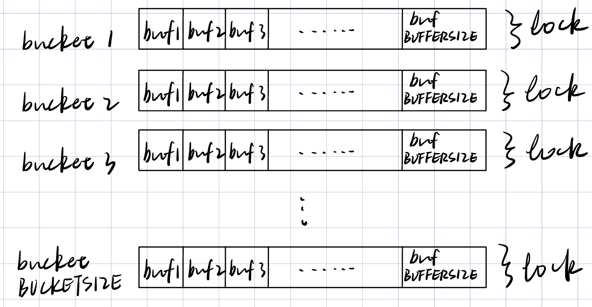
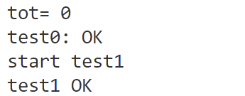
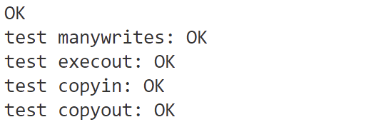
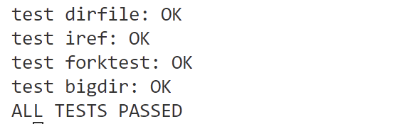

# 华东师范大学数据学院实验报告
<table>
  <tr>
    <td>课程名称 ：操作系统</td>
    <td>年级：2022级</td>
    <td>上机实践成绩：</td>
  </tr>
  <tr>
    <td>指导教师：翁楚良</td>
    <td>姓名：刘蔚璁</td>
    <td></td>
  </tr>
  <tr>
    <td>上机实践名称：Locks </td>
    <td>学号：10225501443</td>
    <td>上机实践日期：2024.6</td>
  </tr>
</table>

## 一、实验目的
- 优化block cache争用
- 改进 xv6 操作系统的缓冲区缓存（buffer cache），以减少在多进程频繁使用文件系统时对 `bcache.lock` 的争用。
## 二、实验内容
- 原始版本的 buffer cache 由一个大锁 `bcache.lock` 保护, 限制了并行运行的效率，且使用的是双链表的管理方式。
- 修改 `kernel/bio.c` 文件：放弃双链表的管理方式，利用 hash bucket 思想修改缓冲区缓存，以减少对 `bcache.lock` 的争用。使用哈希表在缓存中查找块号 block number，哈希表的每个哈希桶都有一个锁。
- 删除所有缓冲区的列表（如 `bcache.head` 等），改为使用缓冲区上次使用的时间戳（即使用 `kernel/trap.c` 中的 `ticks` ）。通过这种改变， `brelse` 不需要获取 `bcache` 锁， `bget` 可以基于 ticks 选择最近最少使用的块。
- 运行 `bachetest` 时，`bcache` 中所有锁的 `acquire` 循环迭代次数接近于零。理想情况下，块缓存中涉及的所有锁的计数之和应该为0，本实验允许总和小于500。
- 保持每个块最多只有一个缓存副本的不变性。
## 三、实验环境
- Ubuntu
- VSCode
## 四、实验过程及结果
### 预备知识
#### 自旋锁和睡眠锁
- ##### 自旋锁
    自旋锁是一种简单的锁机制，它使用忙等待的方式来获取锁。当一个线程尝试获取自旋锁时，如果锁已经被其他线程持有，那么该线程会一直循环检查锁的状态，直到获取到锁为止。
    在xv6中，自旋锁通常用于保护短期的临界区，因为自旋锁不会引起线程的睡眠，不会导致线程上下文的切换，因此适用于临界区执行时间较短的情况。
    - 使用场景：
        - 保护共享资源的临界区，例如对内核数据结构的访问。
        - 在内核中的中断处理程序中，因为中断处理程序通常需要尽快完成，自旋锁可以避免睡眠造成的延迟。
    
    - **常见操作：**
        - `initlock(struct spinlock *lk, char *name)`: 初始化自旋锁。
        - `acquire(struct spinlock *lk)`: 获取自旋锁。
        - `release(struct spinlock *lk)`: 释放自旋锁。
- ##### 睡眠锁
    睡眠锁是一种更高级别的锁机制，它在锁已被其他线程持有时，会使当前线程进入睡眠状态，等待锁的释放。与自旋锁不同，睡眠锁可以在获取锁时释放CPU，允许其他线程运行。
    在xv6中，睡眠锁通常用于保护长期的临界区，因为长时间的自旋等待可能会浪费CPU资源。此外，睡眠锁也可以用于需要休眠的情况，例如等待磁盘I/O完成。
    - 使用场景：
        - 保护共享资源的长期临界区，例如文件系统中的数据结构访问。
        - 等待外部事件发生，例如等待磁盘I/O完成。
    - **常见操作：**
        - `initsleeplock(struct sleeplock *lk, char *name)`: 初始化睡眠锁。
        - `acquiresleep(struct sleeplock *lk)`: 获取睡眠锁。
        - `releasesleep(struct sleeplock *lk)`: 释放睡眠锁。
        - `holdingsleep(struct sleeplock *lk)`: 检查当前线程是否持有睡眠锁。
#### 缓存管理
在 xv6 操作系统中，buf 和 bcache 是用于磁盘 I/O 缓冲管理的关键数据结构。它们用于缓存从磁盘读取或写入的块（block），从而提高了文件系统的性能。
- ##### buf 结构体
    buf 结构体代表了一个磁盘块（block）的缓冲区，它包含了磁盘块的数据以及与之相关的元数据，用于实现缓存机制，以提高对频繁访问的块的访问速度。
    ```c
    struct buf {
        int valid;   /* 表示缓冲区中的数据是否有效。
        如果 valid 为 1，表示缓冲区中的数据已经从磁盘读取并有效，
        如果为 0，则表示数据无效，可能是未初始化或者数据已过期。*/
        int disk;    // 表示该缓冲区是否由磁盘 "拥有"。
        uint dev;    // 表示磁盘设备的编号 
        uint blockno;// 表示磁盘上的块号
        struct sleeplock lock; // 一个睡眠锁，用于保护对该缓冲区的访问。
        uint refcnt; // 缓冲区的引用计数，表示有多少线程正在使用该缓冲区。
        struct buf *prev; // LRU cache list
        struct buf *next;
        uchar data[BSIZE];// 用于存储磁盘块的实际数据
    };
    ```
- ##### bcache 结构体
    bcache 结构体代表了整个磁盘缓冲区（buffer cache），它是管理所有 buf 结构体的容器。它的主要作用是管理缓冲区的分配与回收，以及提供对缓冲区的高效访问。它提供了一种机制，使得磁盘 I/O 操作可以尽可能地利用缓冲区，从而提高了文件系统的性能。
    ```c
    // 包含缓冲区缓存的结构体
    struct {
        // 自旋锁，用于保护缓冲区缓存的数据结构
        struct spinlock lock;
        // 缓冲区数组，每个元素都是一个缓冲区
        struct buf buf[NBUF];

        // 所有缓冲区的链表，通过prev/next指针连接
        // 链表按最近使用的顺序排序
        // head.next是最近使用的缓冲区，head.prev是最久未使用的缓冲区
        struct buf head;
    } bcache;
    ```
- 在原始写法中，整个 bcache 由一个自旋锁保护，在任何时刻只有一个线程可以修改 bcache。
- bcache 中的缓冲区是通过双向链表组织的，通常用于实现缓存的替换策略。xv6 使用头插法插入最近使用的缓冲区，以确保最近使用的缓冲区总是位于链表的头部。

### 实验思路
实验的核心分为两点：
- 把原本一整个磁盘缓冲区分为若干个桶，使用块号把不同的缓冲块哈希到不同的桶中，并把原本的对整个缓冲区加锁改成对每个桶分别加锁。
    - 修改前
        
    - 修改后
        
- 原本根据双向链表逆向检索实现 LRU（最近最少使用） 组织缓冲块，现在改成数组 + 系统时间中断数来找到目标块。

#### 数据结构修改
据此，先对两个数据结构进行修改：
- ##### `struct buf`
    添加字段：`uint timestamp;` ，该字段用于记录最后使用缓存块的时间。
- ##### `struct bcache` -> `struct bcachebucket`
    ```c
    #define BUCKETSIZE 13 // number of hashing buckets
    #define BUFFERSIZE 5 // number of available buckets per bucket

    struct {
        struct spinlock lock;
        struct buf buf[BUFFERSIZE];
    } bcachebucket[BUCKETSIZE];
    ```
    这个结构定义了一个 bcachebucket 数组，数组的每个元素代表一个桶，每个桶中包含一个自旋锁和一个 buf 数组，用于存放映射到该桶中的缓冲块。
#### 相关函数修改
##### `hash()`
首先定义一个哈希函数，用于根据块号将不同块映射到相应桶中。
```c
int 
hash(uint blockno)
{
  return blockno % BUCKETSIZE;
}
```
##### `binit()`
首先观察原始的 `bint` 实现的功能：
- 为整个磁盘缓冲区分配一个自旋锁
- 创建缓存块的双向链表
- 对每个缓存块初始化一个睡眠锁

而我们现在需要做的是：
- 为每个桶分配一个自旋锁
- 对每个缓存块初始化一个睡眠锁

因此得到代码：
```c
void binit(void)
{
  for (int i = 0 ; i < BUCKETSIZE ; i++){
    initlock(&bcachebucket[i].lock,"bcachebucket");
    for (int j = 0 ; j < BUFFERSIZE ; j++){
      initsleeplock(&bcachebucket[i].buf[j].lock,"buffer");
    }
  }
}
```
##### `bget()`
该函数用于查找设备上的缓存块，如果没有找到则分配一个新的缓存块，无论哪种情况最后都返回被锁定的缓存块。
原始方法的实现逻辑是：
- 通过 dev 和 blockno 检测块是否已经在缓存中，若在缓存中，获取该块的锁并返回该块
- 如果块不在缓存中，通过反向检索链表找到最近最少使用的空闲块，重新初始化其字段，获取该块的锁并返回该块
- 若找不到可用的缓冲块，触发恐慌

我们需要修改的是：
- 首先得到该块映射到的桶号，若该桶中没有就代表缓冲区中没有该块
- 不通过双向链表实现LRU，而是通过比较 timestamp 来找到桶中的 LRU 空闲块，timestamp 越小表示上次被使用的时间越早，要选择上次使用时间最早的空闲块
- 进一步优化，若该桶中不存在空闲块，到邻居桶中查找
- 因为要保持每个块最多只有一个缓存副本的不变性，所以优化时应该也查找邻居桶看是否存在该块，不存在才能开始寻找空闲块，否则可能出现一个块有两个缓存副本的情况

具体代码如下：
```c
static struct buf*
bget(uint dev,uint blockno)
{
  struct buf *b;

  int bucket = hash(blockno);
  int finalBuc = bucket;

  acquire(&bcachebucket[bucket].lock);
  for(int i = 0 ; i < BUFFERSIZE ; i++)
  {
    if(bcachebucket[bucket].buf[i].dev == dev && bcachebucket[bucket].buf[i].blockno == blockno){
      b = &bcachebucket[bucket].buf[i];
      b->refcnt++;
      b->timestamp = ticks;
      release(&bcachebucket[bucket].lock);
      acquiresleep(&b->lock);
      return b;
    }
  }
  release(&bcachebucket[bucket].lock);
```
```c
  if(bucket > 0)
  {
    acquire(&bcachebucket[bucket-1].lock);
    for (int i = 0; i < BUFFERSIZE; i++)
    {
      if(bcachebucket[bucket-1].buf[i].dev == dev && bcachebucket[bucket-1].buf[i].blockno == blockno)
      {
        b = &bcachebucket[bucket-1].buf[i];
        b->refcnt++;
        b->timestamp = ticks;
        release(&bcachebucket[bucket-1].lock);
        acquiresleep(&b->lock);
        return b;
      }
    }
    release(&bcachebucket[bucket-1].lock);
  }

  if(bucket < BUCKETSIZE-1)
  {
    acquire(&bcachebucket[bucket+1].lock);
    for (int i = 0; i < BUFFERSIZE; i++)
    {
      if(bcachebucket[bucket+1].buf[i].dev == dev && bcachebucket[bucket+1].buf[i].blockno == blockno)
      {
        b = &bcachebucket[bucket+1].buf[i];
        b->refcnt++;
        b->timestamp = ticks;
        release(&bcachebucket[bucket+1].lock);
        acquiresleep(&b->lock);
        return b;
      }
    }
    release(&bcachebucket[bucket+1].lock);    
  }

  uint flag = 0xffffffff;
  int idex = -1;
  acquire(&bcachebucket[bucket].lock);
  for (int i = 0; i < BUFFERSIZE; i++)
  {
    if(bcachebucket[bucket].buf[i].refcnt == 0 && bcachebucket[bucket].buf[i].timestamp < flag)
    {
      flag = bcachebucket[bucket].buf[i].timestamp;
      idex = i;
    }
  }
  release(&bcachebucket[bucket].lock);

  // 在邻居 bucket 中获取空闲块
  if(idex == -1)
  {
    if(bucket > 0)
    {
      acquire(&bcachebucket[bucket-1].lock);
      for (int i = 0; i < BUFFERSIZE; i++)
      {
        if(bcachebucket[bucket-1].buf[i].refcnt == 0 && bcachebucket[bucket-1].buf[i].timestamp < flag)
        {
          flag = bcachebucket[bucket-1].buf[i].timestamp;
          idex = i;
          finalBuc = bucket-1;
        }
      }
      release(&bcachebucket[bucket-1].lock);
    }

    if(bucket < BUCKETSIZE-1)
    {
      acquire(&bcachebucket[bucket+1].lock);
      for (int i = 0; i < BUFFERSIZE; i++)
      {
        if(bcachebucket[bucket+1].buf[i].refcnt == 0 && bcachebucket[bucket+1].buf[i].timestamp < flag)
        {
          flag = bcachebucket[bucket+1].buf[i].timestamp;
          idex = i;
          finalBuc = bucket+1;
        }
      }
      release(&bcachebucket[bucket+1].lock);    
    }
  }

  if(idex > -1)
  {
    acquire(&bcachebucket[finalBuc].lock);
    b = &bcachebucket[finalBuc].buf[idex];
    b->dev = dev;
    b->blockno = blockno;
    b->valid = 0;
    b->refcnt = 1;
    release(&bcachebucket[finalBuc].lock);
    acquiresleep(&b->lock);
    return b;
  }

    panic("bget: no buffers");
  
}
```

##### `brelse()`
该函数的作用是释放锁定的缓冲块。
首先观察原函数：
- 先检查当前线程是否持有需要释放的缓冲块的睡眠锁，若无则引发恐慌
- 接着获取整个缓冲区的自旋锁
- 减少对缓冲块的引用计数（refcnt，代表当前有几个进程正在使用该块）
- 如果引用计数为0，表示没有线程在使用这个缓冲块
- 把缓冲块从链表当前位置移除并使用头插法重新插入链表中

我们需要改动的是：
- 若引用计数为零，使用 ticks 重置 timestamp

具体代码如下：
```c
void
brelse(struct buf *b)
{
  if(!holdingsleep(&b->lock))
    panic("brelse");
  
  releasesleep(&b->lock);

  int bucket = hash(b->blockno);
  acquire(&bcachebucket[bucket].lock);
  b->refcnt--;
  if(b->refcnt == 0)
    b->timestamp = ticks;
  release(&bcachebucket[bucket].lock);
}
```

##### `bpin()` / `bunpin()`
这两个函数的作用是增加或减少缓冲块的引用计数。
原始函数和所修改函数的唯一区别是：
- 原始函数在操作前对整个磁盘缓冲区上锁
- 修改后的函数只需要对相应的桶上锁

具体代码如下：
```c
void
bpin(struct buf *b){
  int bucket = hash(b->blockno);
  acquire(&bcachebucket[bucket].lock);
  b->refcnt++;
  release(&bcachebucket[bucket].lock);
}

void
bunpin(struct buf *b){
  int bucket = hash(b->blockno);
  acquire(&bcachebucket[bucket].lock);
  b->refcnt--;
  release(&bcachebucket[bucket].lock);
}
```
#### 测试结果
- ##### bcachetest
    
- ##### usertests
    
    
    ......(省略中间测试)
    
## 五、总结与反思
本次实验深入探讨了 xv6 操作系统中的缓冲区管理机制，包括相关的数据结构 buf 和 bcache 以及对缓冲区的操作函数的实现细节。通过分析和改写代码，我理解了以下关键点：
#### 缓冲区管理机制：
- buf 结构体用于表示文件系统的缓冲块，包括数据、引用计数、锁、设备号和块号等信息。
- bcache 是一个缓冲区缓存结构，使用一个双向链表来管理所有的缓冲块，支持最近最少使用（LRU）的缓存替换策略。
#### 锁机制：
- bcache 使用自旋锁来保护共享数据结构，确保多线程环境下的线程安全。
- buf 结构体中的缓冲块使用睡眠锁来防止并发访问。
#### 缓冲区相关函数的作用和实现细节：
- binit() : 初始化缓冲区及缓冲块
- bget() : 用于查找设备上的缓存块，如果没有找到则分配一个新的缓存块
- brelse() : 释放锁定的缓冲块
- bpin() / bunpin() : 增加或减少缓冲块的引用计数
- 实现细节均已在第四部分体现