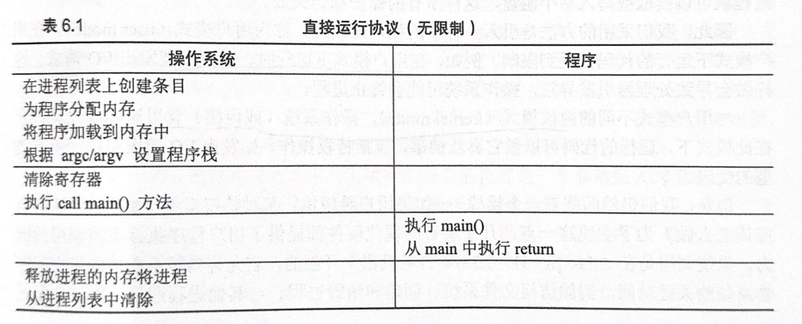
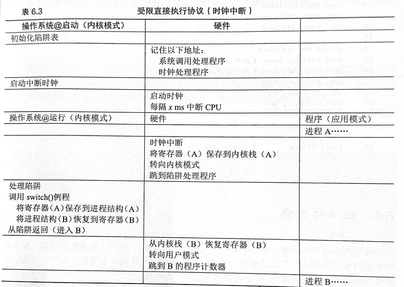

# 操作系统
## 引言
### 第二章 操作系统介绍
#### 操作系统的定义和作用
操作系统是应用程序和硬件之间的核心系统软件
- ##### 提供了访问资源的通用功能
    - 抽象了硬件，提供对资源的标准化接口（接口API/系统调用/标准库）
    - 响应资源访问请求
- ##### 管理：在应用程序间共享（有限的）资源
    - 处理访问控制
    - 调度当前正在执行的进程（提供对资源的高效和公平的访问）
    - 管理硬件资源
    - 隔离：保护应用程序免受彼此的影响
        - 应用程序之间、程序与操作系统之间、进程之间

#### 操作系统管理：
- CPU：
初始化程序计数器/寄存器，共享 CPU
- 程序内存：
初始化进程地址空间，加载程序（代码、数据、堆、栈）
- 设备：
从/写入磁盘；设备驱动程序是硬件特定的，抽象为公共接口

#### 用户模式
- 不能发起对磁盘的 I/O 请求
- 不能访问任何物理内存页
- 不能在网络上发送数据包
- user mode --trap--> trap handler , kernel mode --return from trap --> user mode

## 第一部分：虚拟化
## 关于 CPU 的虚拟化
### 第四章 抽象：进程
#### 真实现状
- CPU 执行无尽的指令流（存储在内存中）
- 所有系统内存位于连续的物理地址空间中
- 磁盘是有限的一组块

处理并发程序 --> 分离不同程序的执行，提供每个程序都是唯一正在运行的程序的幻觉/假象 --> 虚拟进程抽象

#### 程序 VS 进程 VS 线程
- 程序
    - 由静态代码和数据组成，存储在磁盘上
- 进程
    - 程序的一个实例
    - 一个进程由一个地址空间、相关的内核状态（例如打开的文件、网络通道）和一个或多个执行线程组成
    - 一个进程是在进程状态上下文中的一个执行流。执行流是执行指令的序列（即“控制线程”）。进程状态涵盖了执行指令可能影响或受到影响的所有内容（例如，寄存器、地址空间、持久状态，如文件）
    - 进程创建过程
        
    - 进程以单个执行线程和一个地址空间开始,可以在同一地址空间中启动多个线程执行。
- 线程
    - 进程可以在相同的地址空间中拥有多个线程（在相同数据上进行计算）
    - 每个线程都有自己的堆栈，但它们共享全局数据、代码和堆。
    - 一个线程包括堆栈和寄存器状态（堆栈指针、代码指针、其他寄存器）。
- 进程 VS 线程
    两个读取地址 0xc0f3 （虚拟地址）的进程可能读取不同的值，而同一进程中的两个线程将读取相同的值。

#### 共享资源的两种形式
- 时分共享(time sharing)：独占使用，逐个执行
eg.虚拟化 CPU（任务间交替执行）
- 空分共享(space sharing)：每个人始终获得一部分
eg.内存、磁盘空间

#### 虚拟化 CPU
- 目标：给每个进程提供独占 CPU 访问的幻觉
- 现实：CPU 是所有进程共享的资源
- 实现：时分共享（有性能损失）
- 具体实现：
    - 低级机制(mechanism)
        - 如何如何从从一个进程切换到另一个进程
        - 一些低级方法或协议来实现所需功能（上下文切换/context switch）
    - 高级智能
        - 一些智能以策略 (policy) 的形式存在
        - 策略是在操作系统内做出某种决定的算法，选择运行哪个进程
        - eg. 调度策略 (scheduling policy)
            （历史信息、工作负载知识、性能指标）
    - 策略和机制之间的区别实现了模块化。调度策略独立于上下文切换功能。

#### 操作系统提供进程抽象
- 当用户执行一个程序时，操作系统会创建一个进程。
- 操作系统在多个进程之间进行 CPU 的时间共享。
- 操作系统调度器选择一个可执行进程来运行。
    - 调度器必须维护一个进程列表
    - 调度器必须为策略维护元数据

#### 进程的机器状态
即程序在运行时可以读取或更新的内容：
- 进程可访问的内存（地址空间/address space）
    指令、正在运行的程序读取和写入的数据
- 寄存器
    - 程序计数器（Program Counter，PC）（有时称指令指针，IP）
        指示程序即将执行的指令
    - 栈指针、相关的帧指针
        管理函数参数栈、局部变量和返回地址
- 持久存储设备
    此类 I/O 信息可能包含当前打开的文件和其他资源

#### 进程创建
- ##### 操作系统分配内部数据结构
- ##### 操作系统分配地址空间
    - 从磁盘加载代码、数据
        - 早期：加载过程尽早（eagerly）完成
        - 现代：惰性（lazily），仅在程序执行期间需要加载的代码或数据片段才会加载
    - 创建运行时堆栈、堆
        - 栈：局部变量、函数参数和返回地址
        - 堆：显式请求的动态分配数据
        - 用参数初始化栈（将 argc 和 argv 填入 main() 函数）
- ##### 操作系统打开基本文件
    默认情况下每个进程都有三个打开的文件描述符：STDIN、STDOUT、STDERR
- ##### 操作系统初始化 CPU 寄存器
- ##### 启动程序
    入口：main()

#### 进程状态及其转换
- ##### 进程状态
    - 运行中（running）：该进程当前正在执行
    - 准备就绪（ready）：该进程准备好执行（并将在策略决定时进行调度）
    - 阻塞（blocked）：该进程被挂起（例如，等待某个动作；当该动作完成时，操作系统将取消阻塞）
    - 初始（init）：该进程正在创建中（以确保它不会被调度）
    - 最终（final）：该进程已终止但未清理（eg.如果父进程尚未读取返回值）
- ##### 进程状态转换
    

- 保持 CPU 繁忙 --> 提高资源利用率
- 如果所有进程都被阻塞，应该调度空闲进程。
    - 现代内核使用低优先级的空闲进程，如果没有其他进程准备就绪，它将被调度并执行。
    - 空闲进程不会阻塞或执行任何 I/O。
    - 如果没有空闲进程，调度器将不得不检查是否没有进程准备就绪，并且将不得不保守地采取行动。空闲进程保证了始终至少有一个可运行的进程。

#### 进程数据结构
- 操作系统维护活动进程的数据结构（数组/列表），存储在操作系统内核中。
- 每个进程的信息存储在进程控制块中，其中包含：
    - 进程标识符（PID）
    - 进程状态（例如，准备就绪）
    - 指向父进程的指针（cat /proc/self/status）
    - CPU 上下文（如果进程未运行）
    - 地址空间指针（cat /proc/self/maps）
    - 打开文件列表的指针（文件描述符，cat /proc/self/fdinfo/*）
- 当一个进程停止：
    - 它的寄存器被保存到固定内存位置（寄存器上下文）
    - 恢复寄存器（将其写入到实际的物理寄存器中）
    - 该进程恢复

#### 请求操作系统服务
- 进程可以通过系统调用 API（应用程序编程接口）请求服务。
- 系统调用将执行转移到操作系统（启用特权操作）。
- 敏感操作（例如，硬件访问、原始内存访问）需要特权。
- 一些系统调用（例如，read、write）可能会导致进程阻塞，从而允许操作系统调度其他进程。
- 库（libc）隐藏了系统调用的复杂性，将操作系统功能导出为常规函数调用。

### 第五章 进程 API
#### 操作系统接口必须包含：
- ##### 创建（create）
    - UNIX ：fork() 系统调用
      Windows ：CreateProcess() 函数
- ##### 销毁（destroy）
    - UNIX ：exit() 系统调用
      Windows ：ExitProcess() 函数
- ##### 等待（wait）
    - wait() / waitpid()
- ##### 其他控制（miscellaneous control）
    - 自愿阻塞 sleep()、替换程序 exec()、信号处理 signal()、时间设置setitimer()
- ##### 状态（status）  
    - ps() ：查看当前在运行的进程
    - top 工具 ：展示当前系统中进程消耗 CPU 或其他资源的情况

#### fork()
- 父进程调用 fork() 系统调用，内核（操作系统）创建一个新的进程，称为子进程。它与父进程几乎完全相同。
-  父进程和子进程都从 fork() 调用返回。在父进程中，返回子进程的 PID；在子进程中，返回 0。
- 子进程拥有自己的地址空间（私有内存）、寄存器、程序计数器等；
    - 写时复制（Copy-On-Write）机制
-  操作系统安排父进程和子进程交替执行。

#### wait() / waitpid()
- 子进程与其父进程绑定。
- 子进程调用 exit(int retval) ，父进程 wait() 得到一个返回值参数。
- 父进程等待子进程终止再执行。

#### exec()
- 让子进程执行与父进程不同的程序
- exec() 替换地址空间，从磁盘加载新程序。
    - 从可执行程序中加载代码和静态数据，覆盖自己代码段及静态数据
    - 堆、栈及其它内存空间也会被重新初始化
    - 进程 ID 不变
    - 文件描述符 STDIN、STDOUT、STDERR 保留，允许父进程重定向/重新连接子进程的输出
    - eg.在 Unix 系统中执行 shell 命令时，实际上是由 shell 进程调用 exec() 系统调用来执行指定的程序
- 程序可以传递命令行参数和环境
- 对 exec() 的成功调用永远不会返回

#### 为什么需要 fork() 和 exec()？
假设用户想要启动一个不同的程序。为此，操作系统需要创建一个新进程并创建一个新的地址空间来加载程序。
使用分而治之的方法：
- fork() 创建一个带有此地址空间副本的新进程
- exec() 为程序创建一个新的地址空间
- clone() 向此地址空间添加一个线程（执行线程）
    - 新线程与调用线程共享地址空间，但有自己的栈空间和执行线程的上下文

### 第六章 机制：受限直接执行
#### 直接在 CPU 上运行程序存在的问题？
- 进程可能做一些非法的事情（读写不属于进程的内存、直接访问硬件）
- 进程可能永远运行下去（操作系统必须保持控制）
- 进程可能执行一些慢的操作，例如 I/O（操作系统可能希望切换到另一个进程）

#### 构建 CPU 虚拟化机制时存在挑战：
- ##### 性能：如何在不增加系统开销的情况下实现虚拟化？
    - ##### 受限直接执行（limited direct execution）：
        
       
        - 优势：快速
        - 问题：进程可能做非法的事 --限制--> 进程希望执行受限操作怎么办？
            - 受保护的控制权转移（user mode -> kernel mode）：系统调用
            - 陷入内核、从陷阱返回
                - 执行陷阱时硬件必须确保存储足够的调用者寄存器，以便在操作系统发出从陷阱返回指令时能够正确返回。
                - eg.x86，处理器会将程序计数器、标志和其他一些寄存器推送到每个进程的内核栈上。从陷阱返回时将从栈中弹出这些值并恢复执行用户模式程序。
                - ##### 陷阱表
                    机器启动时在内核模式下执行，操作系统首先告诉硬件在发生某些异常事件时要运行哪些代码。
                    执行指令告诉硬件陷阱表的位置也是特权操作。
                    
            

- ##### 控制权：如何有效地运行进程，同时保留对 CPU 地控制？
    - 协作方式：等待系统调用
        - 被动等待程序放弃控制权 `yield()`、系统调用、程序执行了非法操作
    - 非协作方式：操作系统进行控制
        - ##### 时间中断 (timer interrupt)：硬件功能
            每隔几毫秒产生一次中断，操作系统预先配置中断处理程序，启动过程中先启动时钟。
            - 操作系统必须通知硬件哪些代码在发生时间中断时运行
            - 操作系统要在中断发生时为正在运行的程序保存足够的状态，以便从陷阱返回后能正确恢复正在运行的程序
        - ##### 保存和恢复上下文
            - 上下文切换
            将正在运行的进程状态保存在内核结构中，恢复下一个进程的状态，将控制传递给下一个进程并“返回”。
            对进程来说，上下文切换是透明的。
                - 执行一些底层汇编代码实现
                - 切换内容：通用寄存器、程序计数器、当前进程的内核栈指针
            - 进行上下文切换的原因：
                - 进程完成/退出
                - 进程执行慢速硬件操作（从磁盘加载），操作系统切换到另一个准备好的任务
                - 硬件需要操作系统的帮助并发出中断
                - 操作系统决定抢占任务并切换到另一个任务（即进程已经用完了它的时间片）
            - 上下文切换的成本：
                - 保存和恢复寄存器的操作系统操作
                - 程序运行时在 CPU 高速缓存、TLB、分支预测器和其他片上硬件中建立了大量的状态。切换到另一个工作会导致此状态被刷新，且与当前运行的作业相关的新状态被引进 

        

        - 两种类型的寄存器保存/恢复
            - 时间中断时
            运行进程的用户寄存器由硬件隐式保护，使用该进程的内核栈
            - 操作系统决定从 A 换到 B 时
            内核寄存器被 OS 明确保存，存储在该进程的进程结构的内存中（在内核空间，但不是该进程的内核栈）

#### 进程隔离
- 在大多数操作系统上，进程时：
    - 互相隔离的
    - 与操作系统隔离的
- 隔离是安全性的核心要求：
    - 将错误限制在进程内部
    - 启用权限隔离
    - 启用区隔化（将复杂系统分解为独立的错误域）
- ##### 进程隔离机制
    - 虚拟内存：每个进程一个（虚拟）地址空间
    - 不同的执行模式：操作系统以更高的特权级别执行
        - 进程在用户模式下执行（x86 架构上的 ring 3）
        - 操作系统在超级模式下执行（x86 架构上的 ring 0）

### 第七章 进程调度：介绍
#### 关于调度的两个问题
- ##### 如何从一个进程切换到另一个进程
    - 切换机制：上下文切换
    - 保持控制机制：抢占（时间中断）
- ##### 下一个应该运行的是什么进程
    - 策略：调度

#### 调度指标
- ##### 利用率
    CPU 执行程序的时间占总时间的比例（目标：最大化）
- ##### 周转时间
    完成时间 - 到达时间（目标：最小化）
- ##### 响应时间
    调度时间 - 到达时间（目标：最小化）
- ##### 公平性
    所有进程在一段时间内获得相同数量的 CPU （目标：无饥饿）
- ##### 进展
    允许进程向前推进（目标：最小化内核中断）

#### 调度策略
- #### 非抢占式
    非抢占式调度器只有在当前进程自愿放弃 CPU 时才会切换到另一个进程。
    - ##### 先进先出(FIFO) / 先到先服务(FCFS)
        - 简单、易于实现
        - 造成护航效应：一些耗时较少的潜在资源消费者被排在重量级资源消费者后面
        - 长时间运行的任务排在前面会影响响应时间、周转时间
    - ##### 最短任务优先(SJF)
        - 选择具有最短运行时间的就绪任务
        - 对平均周转时间好
        - 如果工作不是同时到达？长时间工作先到达？
- #### 抢占式
    抢占式调度器可以在任何时候获取 CPU 控制权，根据调度策略切换到另一个进程。
    - ##### 最短完成时间优先(STCF)
        - 向 SJF 添加抢占，每当新工作进入系统时，确定剩余工作和新工作中，谁的剩余时间最少，然后调度该工作。
        - 大大提高平均周转时间
        - 对响应时间不敏感
    - ##### 轮转(RR)
        - RR 在一个时间片(time slide)内运行一个工作，然后切换到运行队列中的下一个任务，反复执行直到所有任务完成。
        - 时间片长度必须是时间中断周期的倍数
        - 时间片长度
            - 越短响应时间表现越好，但上下文切换的成本将影响整体性能
            - 需要权衡，长度足够摊销上下文切换成本又不会使响应不及时
        - 响应时间好，但周转时间非常糟糕
        - 公平与周转时间往往需要权衡
    - #### 结合 I/O
        - 当前正在运行的作业在 I/O 期间不会使用 CPU，它被阻塞等待 I/O 完成
        - 在 I/O 期间运行别的作业，实现重叠
- 事实上操作系统通常对每个作业的长度知之甚少

### 第八章 调度：多级反馈列表(MLFQ)
- 挑战：
    调度器必须支持长时间运行的后台任务（批处理进程）和低延迟的前台任务（交互式进程）。
    - 批处理进程：响应时间不重要，关注长时间运行（减少上下文切换成本，关注大量 CPU，不关注时间）
    - 交互式进程：响应时间至关重要，短暂突发（上下文切换成本不重要，不需要太多 CPU 但频繁）

缺少工作长度的先验知识，优化周转时间的同时降低响应时间 -> MLFQ
- MLFQ 中有许多独立的队列，每个队列有不同的优先级
- 任何时刻，一个工作只能存在于一个队列中

#### MLFQ: 基本规则
- ##### 如果 A 的优先级 > B 的优先级，运行 A （不运行 B ）
- ##### 如果 A 的优先级 = B 的优先级，轮转运行 A 和 B
- ##### 工作进入系统时，放在最高优先级（最上层队列）
- 旧版
    （交互式进程保持高优先级，降低长时间占用 CPU 的进程的优先级）
    - 工作用完整个时间片后，降低其优先级（移入下一个队列）
    - 如果工作在其时间片以内主动释放 CPU，则优先级不变

    新版
    - ##### 一旦工作用完了其在某一层中的时间配额（无论中间主动放弃多少次 CPU），就降低其优先级（移入下一级队列）
- ##### 经过一段时间 S，就将系统中所有工作重新加入最高优先级队列
    解决的饥饿问题
    S：太高，长工作饥饿；太低，交互性工作得不到合适的 CPU 时间比例

### 第九章 调度：比例份额
#### 比例份额
- 调度程序的终极目标，是确保每个工作获得一定比例的 CPU 时间，而不是优化周转时间和响应时间

#### 彩票调度
- ##### 基本思想
    为进程发放针对系统各种资源 (如 CPU 时间) 的彩票，当调度程序需作出决策时，随机选择一张彩票，持有该彩票的进程将获得系统资源
- 中奖的机会与其持有的彩票数量成正比
    - 被调度的机会与持有的票数成正比
- 合作进程如果愿意的话可以交换、转让（会归还）彩票、彩票通胀
- 自动地按照正确的比例分配 CPU 资源
- 随机方法：
    - 避免奇怪的边角情况
    - 轻量，不需要记录任何状态
    - 快
- 把进程列表按彩票数递减排序可以提高效率
- 执行时间短时，平均不公平度非常糟糕，执行多时才能得到期待的结果

#### 步长调度（非随机）
- 系统中的每个工作都有自己的步长，这个值和票数值成反比
- 调度程序使用进程的步长及行程值来确定调度哪个进程
    - 当需要进行调度时，选择目前拥有最小形成值的进程，并且在运行之后将该进程的行程值增加一个步长
- 需要全局状态（加入的新进程行程值？）

#### 完全公平调度程序(CFS)
- ##### 思想
    每个任务并行运行，并消耗相等的 CPU 时间份额
- ##### 方法
    计算进程在理想处理器上获得的时间
- 示例
    假设有 4 个进程准备就绪，因此它们每个将获得 CPU 的 1/4（将此时间添加到记账中）
- ##### 虚拟运行时间
    任务的虚拟运行时间指定了其下一个时间片将开始执行的时间。实际上，任务的虚拟运行时间是基于运行的任务总数对实际运行时间的归一化操作
- 实现：将所有进程保留在红黑树中，按最大执行时间排序（跟踪其正余额）
- 调度
    - 调度最左边的进程（具有最高余额的进程）
    - 如果进程退出，则将其从调度树中移除
    - 在中断（时间片结束或 I/O）时，将进程重新插入树中的新位置
    - 重复

## 关于内存的虚拟化
### 第十三章 抽象：地址空间
#### 虚拟化
- 目标：将进程（及其故障）彼此隔离。
    虚拟化使隔离成为可能。一个进程必须被禁止访问另一个进程的内存/寄存器。
- 步骤 
    - 虚拟 CPU 提供私有 CPU 寄存器的幻觉（机制和策略）
    - 虚拟 RAM 提供私有内存的幻觉
#### 地址空间
每个进程都有一组地址，映射到数据（即，从指针到字节的映射），包含运行的程序的所有内存状态
- 静态：代码、全局变量
- 动态：堆（向下生长）、栈（向上生长）
    - 栈：保存当前的函数调用信息、分配空间给局部变量、传递参数和返回值
    - 堆：管理动态分配的、用户管理的内存
        - 需要动态内存的原因
            - 所需内存量可能依赖于任务
            - 输入大小可能在编译时未知
            - 保守的预分配将是浪费的
            - 函数调用（调用帧）
#### 虚拟化内存
- ##### 目标
    - 透明（隐身）
        操作系统实现虚拟内存的方式，应该让运行的程序看不见
    - 效率
    - 保护
        操作系统应确保进程受到保护，不会受其他进程影响，操作系统本身也不会受进程影响
- ##### 挑战
    我们如何可以并行运行多个程序？
    - 地址在代码中被硬编码
   - 静态分配？如果同一任务执行
- ##### 可能的共享机制
    - 时间共享
    - 静态重定位/分配
    - 基址（+ 边界）
    - 分段
    - 虚拟内存

### 第十四章 插叙：内存操作 API
#### 过程调用帧
调用函数会分配一个调用帧 (在栈中分配一块内存)，用来存储所有局部变量和返回给调用者的必要上下文。
- 栈使函数调用帧的存储变得简单
- 存储调用上下文和活动父级帧的序列
- 在函数序言中分配内存，在返回时释放
- 函数返回时前，下一个函数初始化其数据时会覆盖一个函数的数据
#### 内存类型
- 栈内存
    申请和释放操作都是编译器隐式管理的
- 堆内存
    申请和释放操作都由程序员显式完成
#### 堆与操作系统的交互
- 操作系统将一个大块内存交给进程以存储堆对象
- 运行时库（libc）管理这个块
- 内存分配器旨在提高性能、可靠性或安全性

### 第十五章 机制：地址转换